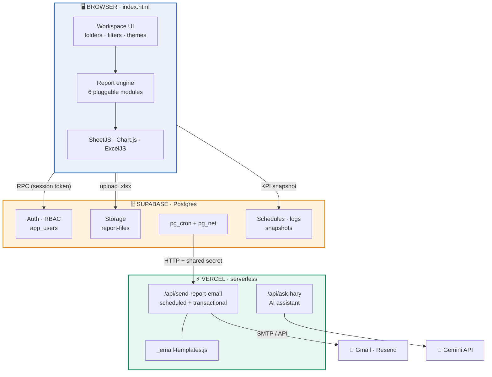
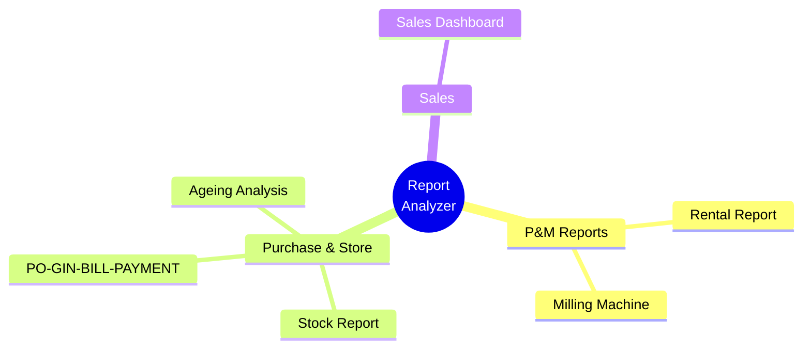
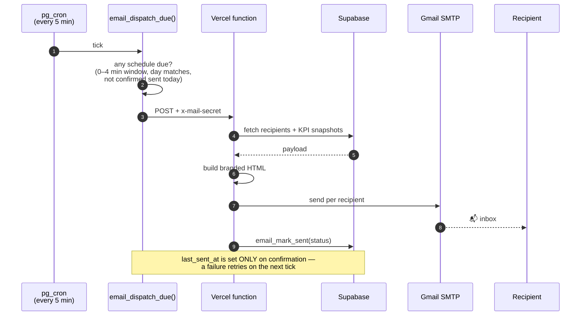
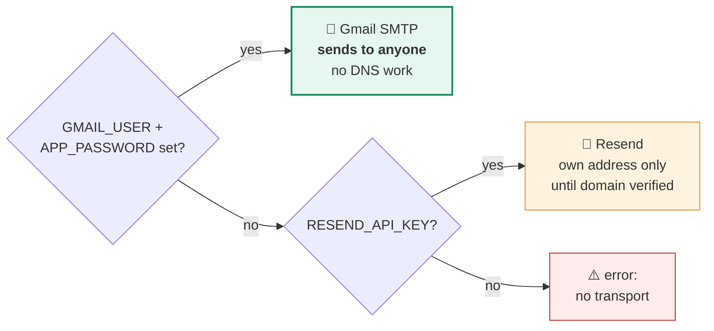
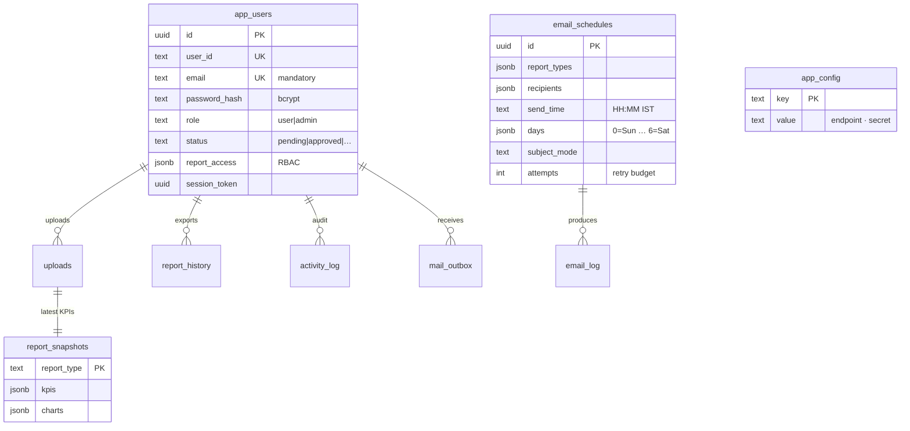

<div align="center">


# VIESL Report Analyzer

### Enterprise ERP reporting platform — upload, analyse, export.

Turn a raw ERP Excel dump into an interactive dashboard and a
reference-accurate Excel workbook, entirely in the browser.

<br>


<br>

**[Live portal](https://vision-report-transformer.vercel.app)** &nbsp;·&nbsp;
[Architecture](#-architecture) &nbsp;·&nbsp;
[Modules](#-report-modules) &nbsp;·&nbsp;
[Setup](#-setup) &nbsp;·&nbsp;
[Troubleshooting](#-operations--troubleshooting)

</div>

---

## 📊 At a glance

<div align="center">

| | | | |
|:---:|:---:|:---:|:---:|
| **6** | **61** | **41** | **61** |
| report modules | KPI cards | interactive charts | filters |
| **9** | **50** | **3** | **4** |
| database tables | secured RPCs | cron jobs | email templates |

</div>

---

## 🎯 What it does

```
   ┌──────────┐     ┌──────────┐     ┌──────────┐     ┌──────────┐
   │  SELECT  │ ──▶ │  UPLOAD  │ ──▶ │ ANALYSE  │ ──▶ │  EXPORT  │
   │  report  │     │ ERP dump │     │ live KPIs│     │  Excel   │
   │  module  │     │  as-is   │     │ & charts │     │ workbook │
   └──────────┘     └──────────┘     └──────────┘     └──────────┘
        │                │                 │                │
   folder-based     no manual        parsed in the      matches the
    workspace       cleaning           browser        reference sheet
                                                       for sheet
```

Every calculation was reverse-engineered from a reference workbook and validated
**to the rupee** against it — for example the Sales grand total of `₹1,81,34,42,536.07`
reconciles across 520 asset rows and 6 monthly columns.

---

## 🏛 Architecture

The core decision: **report processing never leaves the browser.** Raw ERP files are
parsed client-side, so sensitive operational data doesn't need to transit a server to be
analysed. Server-side pieces exist only where a secret must stay hidden.



### Why this shape

| Decision | Reasoning |
|---|---|
| **Client-side processing** | ERP dumps stay on the user's machine; no server needs to hold sensitive operational data |
| **Single `index.html`** | No build step, no bundler, instant static deploy — 8,500 lines but zero toolchain |
| **Serverless only for secrets** | API keys for mail and AI must never reach the browser |
| **`pg_cron` as scheduler** | The database is already always-on; no extra service to run or pay for |
| **Registry-driven modules** | A new report is one registry entry — filters, exports and permissions come free |

---

## 📈 Report modules



<div align="center">

| Module | Status | KPIs | Charts | Filters | Export sheets |
|:---|:---:|:---:|:---:|:---:|:---|
| 🚜 **P&M Rental Report** | `Ready` | 9 | 4 | 7 | styled detail grid |
| 🏗 **Milling Machine Report** | `Ready` | 12 | 10 | 16 | `Main Shet` `R1` `R2` `R4` `R5` `R6` `R7` `R9` `Fleet` |
| 📦 **Stock Report** | `Beta` | 11 | 6 | 8 | `Summary01` `Summary02` `Summary03` |
| 📑 **PO-GIN-BILL-PAYMENT** | `In dev` | 11 | 6 | 8 | `SUMMARY` (8 sections) `Summary02` |
| ⏳ **Ageing Report Analysis** | `Ready` | 8 | 7 | 9 | `Master` `Summery` |
| 💰 **Sales Dashboard** | `Ready` | 10 | 8 | 13 | `Master Data` `Dashboard` `R1` `R2` `EQP WISE` `Client Wise` |

</div>

### Business rules encoded

> These are the non-obvious rules that took reverse-engineering to pin down.

```diff
+ Sales      primary measure is ASSETWISE_INCOME everywhere …
!            … except R1, which intentionally stays on GST_TXABL
+ Sales      Client Wise pivots on TAXABLE VALUE, not assetwise income
+ Sales      customers grouped case-insensitively (SRC Infra ≡ SRC INFRA)
+ Milling    ONLY fleet types MILLING MACHINE and SOIL STABILIZER are processed —
!            all others dropped at parse time, so they reach no KPI, chart or export
+ Milling    "Active" means RUNNING HRS > 0, not merely present in the dump
+ Rental     diesel is read from HDS_ISSUE_QTY
+ All        Month/Year filters sort chronologically across years, not alphabetically
+ Excel      dates are timezone-compensated — ExcelJS writes UTC and would shift
!            01-Apr back to 31-Mar in IST
```

---

## ✨ Features

<table>
<tr>
<td width="50%" valign="top">

### 🎨 Dashboards
- Folder workspace with breadcrumb navigation
- KPI cards + interactive Chart.js visuals
- Sortable, searchable grid with lazy pagination
- Multi-select, range, date-range and **calendar** filters
- Global search across all modules
- Favourites · recent · last-generated
- **Light & dark themes** — WCAG AA verified across 21 colour pairs

</td>
<td width="50%" valign="top">

### 🔐 Access control
- bcrypt hashes · session tokens · approval workflow
- 5-attempt lockout · **1-hour sliding session**
- **Role Rights** — per-user report permissions
- Restricted reports show a 🔒 rather than vanishing
- Blocked on *every* entry path, not just the card
- Admin panel: users · files · activity · rights · alerts

</td>
</tr>
<tr>
<td width="50%" valign="top">

### 📤 Exports
- ExcelJS styled workbooks
- Navy headers · frozen panes · auto-filters
- Borders · number formats · column widths
- Sheet names and order match the reference
- CSV and PDF alongside

</td>
<td width="50%" valign="top">

### 🤖 Hary assistant
- On-device rule-based NLU (scoring + fuzzy match)
- 65-employee directory lookup
- Optional **AI mode** via Gemini
- Answers questions about the open report
- Falls back gracefully when offline

</td>
</tr>
</table>

---

## 📧 Email notification system



### Two delivery paths

<table>
<tr><th width="50%">📅 Scheduled report alerts</th><th width="50%">✉️ Transactional mail</th></tr>
<tr valign="top"><td>

Configured in **Admin → Email Alerts**

- Pick reports, recipients, time, weekdays
- Subject modes with **live preview**:
  - `Report Name + Current Date`
  - `Custom Subject`
  - `All Reports Summary`
- KPI cards + chart data as **HTML bars**
- Retries up to 6× before giving up
- One dispatch per tick — no SMTP collisions

</td><td>

Queued in `mail_outbox`, dispatched every minute

| Template | Trigger |
|---|---|
| `approved` | admin approves an account |
| `accountCreated` | registration received |
| `passwordReset` | password changed |
| `accountLocked` | repeated failed sign-ins |

All share one shell: logo header, contact card, footer.

</td></tr>
</table>

> **No images in emails.** Charts render as coloured table cells, so they display even
> when a client blocks remote images. Everything is table-based with inline styles —
> Outlook strips `<style>` blocks and flex/grid entirely.

### Transport selection



Every log line is prefixed `[gmail]` or `[resend]`, so the path taken is always visible.

---

## 🗂 Project layout

```
ReportsVisualizer/
│
├── 📄 index.html ······················ the entire app  (8,553 lines)
│      ├── shell        auth · workspace · filters · admin · themes
│      ├── REPORTS      6 pluggable report modules
│      └── Hary         in-app assistant
│
├── 📦 package.json ···················· declares nodemailer for the functions
├── ⚙️  vercel.json ····················· serverless function config
├── 🗄️  supabase_setup.sql ·············· schema · 50 RPCs · RLS · cron  (idempotent)
│
├── 📁 api/
│   ├── send-report-email.js ·········· scheduled + transactional mail
│   ├── _email-templates.js ··········· shared branded HTML templates
│   └── ask-hary.js ·················· Gemini-backed assistant endpoint
│
├── 📁 images/ ························ logo.png · logo2.png · background.mp4
└── 🐍 *.py ··························· offline CLI helpers (not used by the app)
```

---

## 🗄 Data model



<div align="center">

| Table | Purpose |
|:---|:---|
| `app_users` | accounts · roles · status · email · report permissions |
| `uploads` | uploaded file metadata |
| `report_history` | per-user export log |
| `activity_log` | full audit trail |
| `email_schedules` | scheduled report alerts |
| `email_log` | delivery outcomes |
| `mail_outbox` | transactional mail queue |
| `report_snapshots` | KPI / chart figures for emails |
| `app_config` | mail endpoint + shared secret |

</div>

---

## 🚀 Setup

<details open>
<summary><b>1 · Supabase</b></summary>

<br>

Create a project → SQL Editor → run **`supabase_setup.sql`**.
It is **idempotent**, so re-run it after every update.

Then create a Storage bucket named **`report-files`**.

> 💡 The **first account registered becomes an approved admin** automatically.

</details>

<details open>
<summary><b>2 · Vercel</b></summary>

<br>

Import the repo, add the environment variables below, deploy.
No build command — `package.json` exists only so `nodemailer` is installed.

</details>

<details open>
<summary><b>3 · Wire the scheduler</b></summary>

<br>

```sql
update public.app_config
   set value = 'https://<your-app>.vercel.app/api/send-report-email'
 where key = 'mail_endpoint';

update public.app_config
   set value = '<same string as MAIL_SECRET>'
 where key = 'mail_secret';
```

Verify:

```sql
select jobname, schedule, active from cron.job;
```

| Job | Schedule | Purpose |
|---|---|---|
| `report-email-dispatch` | `*/5 * * * *` | scheduled report alerts |
| `report-email-reset` | `5 18 * * *` | clears retry counters nightly |
| `outbox-dispatch` | `* * * * *` | transactional mail |

</details>

---

## 🔑 Environment variables

<div align="center">

| Variable | Required | Purpose |
|:---|:---:|:---|
| `SUPABASE_URL` | ✅ | project URL |
| `SUPABASE_SERVICE_KEY` | ✅ | service-role key — **never** expose to the browser |
| `MAIL_SECRET` | ✅ | shared secret; must equal `app_config.mail_secret` |
| `PORTAL_URL` | ✅ | links and logo inside emails |
| `GMAIL_USER` | ⭐ | mailbox that sends |
| `GMAIL_APP_PASSWORD` | ⭐ | 16-character Google App Password |
| `MAIL_FROM` | ◽ | `VIESL Reports <viesl.report@gmail.com>` |
| `RESEND_API_KEY` | ◽ | fallback transport |
| `GEMINI_KEY` | ◽ | enables Hary's AI mode |
| `APP_VERSION` | ◽ | shown in the email footer |

✅ required &nbsp;·&nbsp; ⭐ strongly recommended &nbsp;·&nbsp; ◽ optional

</div>

> ⚠️ The **service-role key bypasses row-level security.** It belongs in Vercel
> environment variables only — never in the repo, never in the browser.

The Supabase URL and *anon* key sit at the top of `index.html`. Both are public by
design; RLS and the RPC layer enforce access.

---

## 📦 Deployment

```bash
git add .
git commit -m "your change"
git push origin main          # Vercel deploys automatically
```

**Post-deploy checklist**

```
✔  https://<app>.vercel.app/api/send-report-email
   → {"ok":false,"error":"Method not allowed."}      function is live

✔  re-run supabase_setup.sql                          if the SQL changed
✔  Admin → Email Alerts → Send test                   before trusting a schedule
```

---

## 🔧 Operations & troubleshooting

<details>
<summary><b>📡 Email not arriving — diagnostic queries</b></summary>

<br>

```sql
-- 1. did the request reach Vercel?
select status_code, left(content, 300), created
  from net._http_response order by created desc limit 5;

-- 2. what did the app record?
select sent_at, title, status, detail
  from public.email_log order by sent_at desc limit 10;

-- 3. is the schedule actually due?
select title, enabled, send_time, days, last_sent_at, attempts
  from public.email_schedules;

-- 4. is the endpoint configured correctly?
select key, value from public.app_config;
```

</details>

<div align="center">

| Symptom | Root cause | Fix |
|:---|:---|:---|
| `404` + HTML body | wrong `mail_endpoint`, or function not deployed | correct `app_config`, verify the URL |
| `401 Bad or missing secret` | `MAIL_SECRET` ≠ `app_config.mail_secret` | make them byte-identical, redeploy |
| `403 validation_error` | Resend domain unverified | use Gmail SMTP |
| `535-5.7.8` | wrong / revoked App Password | regenerate, paste without spaces |
| stuck on `queued` | no confirmation received | retries automatically next tick |
| `next: Tue …` unexpectedly | today's send window already passed | schedule window is only 5 minutes |
| landing in spam | new sender, no domain reputation | whitelist org-wide (below) |

</div>

<details>
<summary><b>📬 Fixing spam placement</b></summary>

<br>

**admin.google.com → Apps → Google Workspace → Gmail → Spam, Phishing and Malware →
Email allowlist** → add the sender address.

One action covers every `@visioninfraindia.com` recipient. A generic Gmail sender has no
domain reputation — verifying the company domain in Resend is the durable fix.

</details>

<details>
<summary><b>⏰ Schedule timing rules</b></summary>

<br>

- Times are **IST**, 24-hour — `00:00` is midnight, `12:00` is midday
- Prefer **5-minute boundaries** (`09:00`, `09:30`) so the tick lands at the window start
- **Stagger** schedules; two in the same tick can collide over one SMTP connection
- The send window is **0–4 minutes** — a time already past today waits for the next
  selected weekday

</details>

---

## ⚠️ Known limitations

> Stated plainly rather than buried — these are real constraints, not oversights.

| Limitation | Why | Path forward |
|:---|:---|:---|
| **Email KPIs come from a snapshot** | figures are computed in the browser; the mail function has no browser | extract modules into a shared engine both browser and Node can load |
| **No email attachments** | export files are built by browser JavaScript | emails link to the portal instead — also avoids the ~25 MB mail cap |
| **RBAC enforced client-side** | reports process in-browser; there is no per-report API to guard | DB remains the authoritative permission store |
| **PO-GIN-BILL-PAYMENT incomplete** | pivot rules not yet confirmed | marked `Under Development` in the UI |
| **Large `.xls` files** | legacy format parses slowly | re-save as `.xlsx` before upload |
| **~500 recipients/day** | Gmail sending cap | ample at current volume |

---

<div align="center">

### Built by

**Harshal Khadatare** — Data Engineer, IT
Report requirements by **Sandeep Patil** — Manager, P&M / Audit

<br>

**Vision Infra Equipment Solutions Ltd**
4th floor, International Business Bay, Gurunanak Nagar, Pune 411042, Maharashtra, India

<sub>© 2026 Vision Infra Equipment Solutions Ltd · All rights reserved</sub>

</div>
